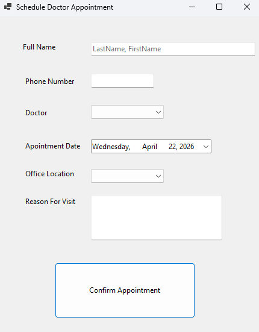

# DentalAppointment

Simple Windows Forms application to manage dental appointments.

## Project description

`DentalAppointment` is a small .NET 10 Windows Forms application to create, view, 
and manage dental patient appointments. It is intended as a starter project or learning
example for building desktop apps with WinForms.

## Prerequisites

- Windows 10/11
- .NET 10 SDK installed (matching the project's `net10.0-windows` target)
- Visual Studio 2022/2026 (recommended) or Visual Studio Code with C#/.NET support

## Build and run
1. Clone the repository
From the repository root you can build and run using the .NET CLI:

```
dotnet build
dotnet run --project DentalAppointment
```

Alternatively, open the project in Visual Studio and press F5 to run.

## Features

- Create dental appointments

## Screenshots


